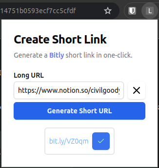

# Generate fake Bitly Links (Chrome Extension)

This was built to practice building Chrome extensions with React.
Read this [article](https://civilgoody.notion.site/How-I-Built-a-Chrome-Extension-With-React-Vite-Fake-Bitly-Link-Generator-4bc270d836a14751b0593ecf7cc5cfdf) to learn how I built it.

## Features

1. Auto Copy current tab URL.
   
2. Clear Input Field button.

   

3. Copy generated Bitly link to clipboard.

   

## How it works

When you click on the extension icon, it copies the current tab url to the editable input field.

You can then generate a fake Bitly link by clicking the `Generate Short Url` button. The generated link can be copied to your clipboard.

This was forked from a [Chrome extension template](https://github.com/5tigerjelly/bitly-extension) and built using React and [Vite](https://vitejs.dev/) with TypeScript.

## Getting Started

### Prerequisites

Make sure you have [Node.js](https://nodejs.org/) (version 18+ or 20+) installed on your machine.

### Quick Setup

#### Unzip the build folder

1. Download the [zipped build folder](https://github.com/codelawani/chrome-extension-react-template/releases/download/v0.1.0-alpha/build.zip) from the [releases](https://github.com/codelawani/chrome-extension-react-template/releases) page.
2. Unzip the folder

#### Load the extension in Chrome

1. Open Chrome and navigate to `chrome://extensions/`.
2. Enable "Developer mode" using the toggle switch in the top right corner.
3. Click "Load unpacked" and select the unzipped folder.

#### Try it out

1. Click on the extension icon in the top right corner of your browser to generate a fake Bitly link.
2. Click on the link to copy it to your clipboard.
3. Paste the link wherever you want!
4. Enjoy!

### Setup

1. Clone or fork the repository :

   ```sh
   # To clone
   git clone https://github.com/5tigerjelly/bitly-extension
   cd bitly-extension
   ```

2. Install the dependencies:

   ```sh
   npm install
   ```

## 🏗️ Development

To start the development server:

```sh
npm run dev
```

This will start the Vite development server and open your default browser.

## 📦 Build

To create a production build:

```sh
npm run build
```

This will generate the build files in the `build` directory.

## 📂 Load Extension in Chrome

1. Open Chrome and navigate to `chrome://extensions/`.
2. Enable "Developer mode" using the toggle switch in the top right corner.
3. Click "Load unpacked" and select the `build` directory.

Your React app should now be loaded as a Chrome extension!

## 🗂️ Project Structure

- `public/`: Contains static files and the `manifest.json`.
- `src/`: Contains the React app source code.
- `vite.config.ts`: Vite configuration file.
- `tsconfig.json`: TypeScript configuration file.
- `package.json`: Contains the project dependencies and scripts.

## License

This project is licensed under the MIT License.
